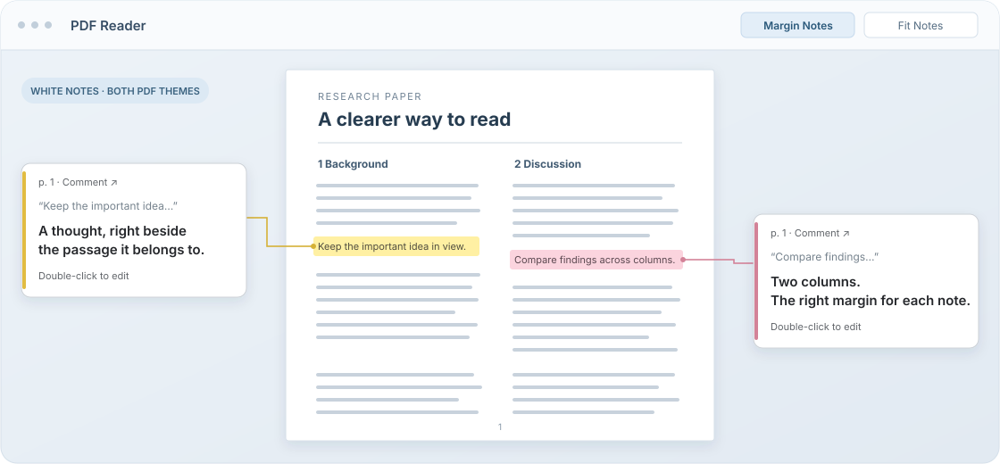

<h1 align="center">Margin Notes for Zotero</h1>

<p align="center">Read and edit PDF annotation comments in the left or right outer margin, chosen automatically for two-column papers.</p>

<p align="center">
  <a href="https://github.com/junhwan26/zotero-margin-notes/actions/workflows/ci.yml"></a>
  <a href="https://github.com/junhwan26/zotero-margin-notes/releases/latest"></a>
  
  <a href="LICENSE"></a>
</p>

<p align="center">
  <a href="README.md">English</a> ·
  <a href="README.ko.md">한국어</a> ·
  <a href="https://github.com/junhwan26/zotero-margin-notes/releases/latest">Download</a> ·
  <a href="#quick-start">Quick Start</a> ·
  <a href="#compatibility">Compatibility</a>
</p>



<p align="center"><sub>Conceptual illustration. The real UI appears inside Zotero's PDF reader and follows the current PDF viewport.</sub></p>

## Why Use It

| Feature | What it does |
| --- | --- |
| Margin note cards | Shows comments from highlights, underlines, and note annotations as white cards outside the page. |
| Two-column placement | Chooses the left or right outer margin from annotation coordinates, available room, and nearby card congestion. |
| Zotero 10 Reading Mode safety | Suspends margin notes per reader pane while Zotero Reading Mode is active, then resumes when the pane returns to PDF view. |
| Zotero workflow preservation | Keeps text selection, selection popups, annotation tools, keyboard selection, search, zoom, page navigation, deletion, undo/redo, and sidebar edits working. |

## Quick Start

1. Download `zotero-margin-notes-0.3.1.xpi` from the [latest release](https://github.com/junhwan26/zotero-margin-notes/releases/latest).
2. In Zotero, open **Tools -> Plugins**.
3. Open the gear menu, choose **Install Plugin From File...**, and select the XPI.
4. Open a PDF, add a comment to a highlight, underline, or note annotation, then use **Margin Notes** in the reader toolbar.

<details>
<summary>Upgrading from 0.1.0</summary>

The `0.1.0` build used a placeholder update URL. Install `0.2.0` or later manually once; after that, Zotero can use this repository's `updates.json` release metadata.

</details>

## Gestures

| Action | Gesture |
| --- | --- |
| Toggle margin notes | Click **Margin Notes** in the Zotero PDF reader toolbar. |
| Make room for notes | Click **Fit Notes** when the window is too narrow; hidden Reading Mode PDF panes are ignored. |
| Edit plain text | Double-click a margin note or overflow comment. |
| Keyboard edit | Focus the comment with Tab, then press **Enter** or **F2**. |
| Save or cancel | Use **Save** or **Cancel** in the inline editor. |
| Open the source annotation | Click the page link in a note header. |

Saving an empty comment removes that card from the margin view because the plugin displays annotations that contain comments. Double-clicking inside an active editor keeps normal word selection. Comments containing rich text delegate to Zotero's native editor instead of flattening formatting.

White notes and editors remain readable in both PDF themes. Comments are saved in Zotero annotations. English is the default interface language; Korean Zotero locales select Korean automatically.

## Compatibility

Margin Notes has no required third-party Zotero add-on and no npm runtime package dependency. It targets Zotero `9.0` through `10.0.*`, with native validation on Zotero `9.0.6` and `10.0.6`. The plugin is PDF-only; EPUB and web snapshots are ignored.

The `0.3.1` release expands the display scope from highlights and underlines to Zotero note annotations. Note annotations do not have a selected-text quote, so their margin cards hide the quote area and show the annotation comment.

The `0.3.1` build passed 26 Node tests, update metadata verification, syntax checks, diff checks, a reproducible build, 246/246 native checks on Zotero `9.0.6`, and 263/263 native checks on Zotero `10.0.6`. The current XPI and the copy installed in Zotero 10.0.6 share SHA-256 `9648934bc1566ac7557bd6701ec54288c786a6ec02aa2752e749ecfc7db6922f`. A local Zotero 10.0.6 UI check showed Margin Notes 0.3.1 enabled, and page 7 of an actual PDF with existing native note annotations exposed two note cards through accessibility. Read the [compatibility notes](docs/compatibility.md) and [public 0.3.1 evidence](docs/evidence/compatibility-0.3.1.json) for the dependency audit, check inventory, and observed add-on state.

Historical `0.3.0` evidence remains available in the [public 0.3.0 evidence snapshot](docs/evidence/compatibility-0.3.0.json).

Historical `0.2.3` evidence remains available: it passed [218 native Zotero 9.0.6 runtime checks](https://github.com/junhwan26/zotero-margin-notes/actions/runs/37580613959) and 23 Node tests. The 2026-10-07 installed-add-on observation with Better BibTeX, Translate for Zotero, Ethereal Style, Research Vault Bridge, and disabled ZotMoov is a Zotero 9.0.6-era local observation, not a Zotero 10 integration certification.

## Support

Open a [GitHub issue](https://github.com/junhwan26/zotero-margin-notes/issues) with your Zotero version, plugin version, operating system, a small reproduction, whether Reading Mode was active, and whether the problem still happens with only Margin Notes enabled. Reader internals can change between Zotero releases, so exact version details matter.

## Acknowledgments

The README structure was informed by public Zotero plugin documentation from [Zotero PDF Translate](https://github.com/windingwind/zotero-pdf-translate/blob/main/README.md), [Better Notes for Zotero](https://github.com/windingwind/zotero-better-notes/blob/master/README.md), [Zotero Style](https://github.com/MuiseDestiny/zotero-style/blob/master/README.md), and [Better BibTeX](https://github.com/retorquere/zotero-better-bibtex/blob/master/README.md). This is a documentation reference, not an endorsement or compatibility claim.

<details>
<summary>Development</summary>

This repository has no npm runtime dependencies. Development uses Node.js for unit tests and syntax checks, and Python 3 for the reproducible XPI build.

```sh
npm test
npm run check
npm run build
```

Native Zotero smoke tests use a temporary profile, a synthetic PDF, and the Zotero app under test. CI downloads Zotero `9.0.6` and `10.0.6` from the official Zotero release host, verifies each DMG SHA-256, installs Zotero into the runner's temporary directory, and uploads one `runtime-smoke-report` artifact per Zotero version. See the [Check workflow](https://github.com/junhwan26/zotero-margin-notes/actions/workflows/ci.yml) for the current CI setup.

Zotero's [Zotero 10 for Developers](https://www.zotero.org/support/dev/zotero_10_for_developers) guide says plugins should update `strict_max_version` to `10.0.*` after confirming compatibility. The current CI matrix follows that migration by testing the declared manifest range against Zotero `9.0.6` and `10.0.6`.

</details>
